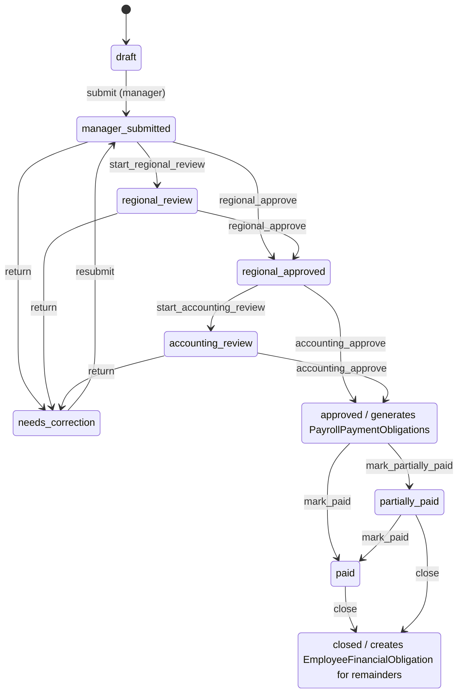

# CLUB-OPS — Status State Machines

Extracted from schema + pure decision modules + the server actions that execute transitions
(commit `71f1cff`). Money is integer kopeks. "Strategic" = owner / general director (read-only in
finance contours). Findings referenced as ARCH-### live in `full-audit-01-code-architecture.md`.

Regenerate the raw status inventory with `npm run audit:status-transitions`
(`docs/audits/data/status-transitions.json`): 48 `*_STATUS*` const arrays, 225 manual
`status:"…"` writes, 52 distinct produced status values, cancel-spelling drift 42/60.

---

## 1. Invoice  (`lib/invoices.ts` · `invoices/actions.ts`)
**Statuses:** `draft · needs_review · needs_correction · approved_by_regional · approved_by_chief_accountant · approved_by_owner(legacy) · paid · rejected · canceled` + **`partially_paid` (reachable but undeclared)**.
**Machine:** pure `applyInvoiceAction` (decision table) + executor `applyInvoiceWorkflowAction` (compare-and-set `updateMany({where:{id,status:existing}})`).
- send_to_review: draft|needs_correction → needs_review (creator, manager|regional)
- approve: needs_review → approved_by_regional (else approved_by_chief_accountant); **invoices ALLOW regional self-approval** (differs from refund/expense)
- return_for_correction, reject, cancel(draft only), pay(approved_* → paid, accountant)
**Side effects:** approve stamps `approvedDataFingerprint`; pay runs `invoicePaymentBlockedReason`. **Guard:** single shared predicate. **Reversible:** needs_correction bounces to author; paid/rejected/canceled terminal.
**Risks:** ARCH-008 (`partially_paid` undeclared in `INVOICE_STATUSES`/labels/action table); ARCH-010 (dual pay path — the `pay` action flips to `paid` with **no InvoicePayment ledger row**, while `recordInvoicePayment` is the ledger path → a `paid` invoice with `paidTotalKopeks=0` is possible if the legacy pay button is UI-exposed); `approved_by_owner` legacy-only (never produced).

## 2. InvoicePayment  (`invoice-payments.ts`)
**Statuses:** `confirmed → reversed` (append-only). Record inside `$transaction` with `idempotencyKey`; P2002 treated as duplicate-success. Reverse = **chief accountant only** (`canReverseInvoicePayment`). Invoice status is **derived** (`derivedInvoiceStatus`). **Model example of a correct money mutation** (ARCH-002 contrast).

## 3. Expense  (`expense-status.ts` · `expense-simplified.ts` v2 · `expenses/actions.ts` v1)
**TWO workflows on one model, discriminated by `entryVersion` (1=legacy, 2=simplified).**
- **v2:** draft → submit (routed by `routeExpenseBudget`: in-budget → pending_accountant_verification; ≤5% overrun → pending_regional; >5%/no budget → pending_owner) → approve(regional/owner) → verify (**creates the one CashMovement**) → verified. cancel → cancelled. Shared pure guards + compare-and-set.
- **v1:** ad-hoc — creates `confirmed` or `waiting_budget_approval` (+BudgetApprovalRequest), no shared decision table.
**Cash semantics:** in review the expense already draws ИП cash by **derived** status; the ledger row is written only at verify.
**Risks:** ARCH-009 (`cancelled` vs `canceled` both live), v1/v2 vocab coexistence (ARCH-012).

## 4. Refund  (`approval.ts` v1 · `refund-workflow.ts` v2)
**TWO disjoint machines on one `Refund` table, discriminated by `entryVersion` (guarded at both executors).**
- **v1:** draft → needs_review → approved_by_* → paid|rejected; **creator may NOT self-approve** (differs from invoice).
- **v2:** draft → pending_regional_review → accounting_in_progress → paid (compare-and-set); or → needs_correction; soft-cancel → canceled. Pay creates **no Expense** — analytics reads paid refunds directly.
**Risks:** ARCH-012 (v1/v2 different vocabularies on one table); `approved_by_owner` legacy.

## 5. CashRegionalTransfer  (`collections/actions.ts`)
**Statuses:** `pending_confirmation → confirmed | cancelled`. Confirm = **explicit club manager only** (regional can't self-confirm). A **confirmed transfer can never be cancelled** (compare-and-set on pending). No CashMovement — only `confirmed` reduces the ИП fact balance (`REGIONAL_TRANSFER_FACT_STATUSES`). `idempotencyKey` unique. Irreversible once confirmed.

## 6. BalanceSnapshot  (`collections/actions.ts`)
**Statuses:** `active → superseded | cancelled` (append-only + `version`, `supersedesSnapshotId`). correct: old→superseded + new active `version+1`. cancel: active→cancelled (amount/date never edited).
**Resolver:** latest `active` with `snapshotDate ≤ instant`.
**Risk:** ARCH-001 — `balance-snapshots.ts::getLatestBalancesForScope/ByClub` (used by dashboard/analytics/payments) **omit the `status` filter and the date cutoff**, so after a **cancellation** the dashboard shows the cancelled snapshot's balance while the cash contour reads 0 → on-screen financial divergence.

## 7. PayrollPeriod  (`payroll/period.ts` RULES table · `periods/actions.ts`)
**Statuses:** draft · manager_submitted · regional_review · needs_correction · regional_approved · accounting_review · approved · partially_paid · paid · closed. Single shared decision table.
**Side effects:** → approved locks calcs + **generates PayrollPaymentObligations**; → closed converts remainders/overpayments into `EmployeeFinancialObligation`. Locked after approved (only PayrollAdjustment corrections). Close blocked with pending payments / open change-requests.

## 8. PayrollChangeRequest  (`payroll/change-request.ts` · `change-requests/actions.ts`)
**Statuses:** draft · submitted · under_review · returned_for_revision · approved · rejected · cancelled · applied · approved_pending_scheme_creation · superseded.
**Approve collapses approve+apply.** `appliedToken` idempotency.
**Risks:** ARCH-011 — **`under_review` unreachable** (no writer); `approved` never a resting state; `superseded` set only by the scheme-versioning service.

## 9. BudgetChangeProposal  (`payroll/budget-linkage.ts` · `budgets/proposal-actions.ts`)
**Statuses:** pending → approved | rejected | superseded. approve upserts the salary Budget (the only proposal→budget mutation). Propose = regional/owner/GD; approve = owner/GD only.
**Risk:** ARCH-011 — **`superseded` declared but never set** by any code path.

## 10. PayrollPaymentObligation  (`payroll/payment-obligation.ts`)
**Statuses:** planned · due · partially_paid · paid · cancelled — **derived** by `obligationStatusOf` on every regeneration. Idempotent upsert by `idempotencyKey`; **cancelled never resurrected**. Cancel = chief accountant only + reason. Only from `approved+` periods. Clean append-only model.

## 11. PayrollPayment  (`periods/actions.ts`)
**Statuses:** pending · confirmed · canceled. Created **directly as `confirmed`**; record → `createSalaryExpense` (one Expense + cash movement) + link `expenseId`; cancel → `cancelSalaryExpense` (reverses).
**Risks:** ARCH-011 — **`pending` unreachable** (all created confirmed); **ARCH-002** — record is 3 sequential top-level writes with **no `$transaction` and no idempotency** (`createSalaryExpense` uses the global prisma client) → mid-op failure orphans / double-submit double-deducts.

## 12. MandatoryPaymentPlan  (`mandatory-payments/actions.ts`)
**Statuses:** planned · paused · canceled (label toggles). No shared state-machine module — CRUD gated by page RBAC + scope only. Thinnest machine; feeds the payment calendar.

---

## Cross-cutting findings (see ARCH-### for severity)
1. **ARCH-010 Invoice dual pay-path** — legacy `pay` action (no ledger row) vs `recordInvoicePayment` (ledger). Verify UI wiring; a ledgerless `paid` is possible.
2. **ARCH-008 Undeclared `partially_paid`** — reachable via `derivedInvoiceStatus`, absent from `INVOICE_STATUSES`/labels/action table (no label, no transitions).
3. **ARCH-011 Unreachable / non-resting statuses** — `PayrollChangeRequest.under_review`, `BudgetChangeProposal.superseded`, `PayrollPayment.pending`; `PayrollChangeRequest.approved` never rests.
4. **Legacy `approved_by_owner`** — Invoice + Refund v1: readable/payable, never produced.
5. **ARCH-012 v1/v2 dual workflows on shared tables** — Refund (`approval.ts` vs `refund-workflow.ts`) and Expense (ad-hoc v1 vs `EXP.*` v2), discriminated by `entryVersion`.
6. **ARCH-009 Spelling drift `cancelled` vs `canceled`** — both live (42/60); a cross-entity status query is a normalization hazard.
7. **Shared vs ad-hoc guards** — Invoice, Refund-v1, Expense-v2, PayrollPeriod, PayrollChangeRequest use a shared pure predicate module; BudgetChangeProposal, MandatoryPaymentPlan, CashRegionalTransfer, BalanceSnapshot, PayrollPaymentObligation, PayrollPayment, Expense-v1 are gated by inline compare-and-set + role checks (safe, but each is its own guard — no single transition registry).

## Representative machine (PayrollPeriod)

