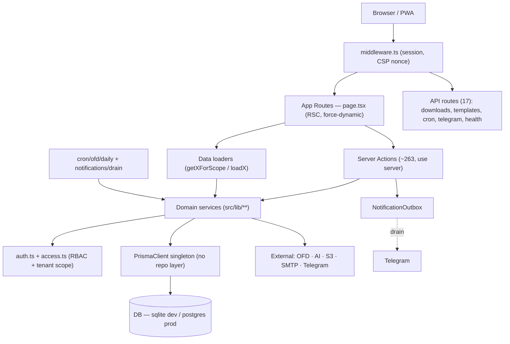
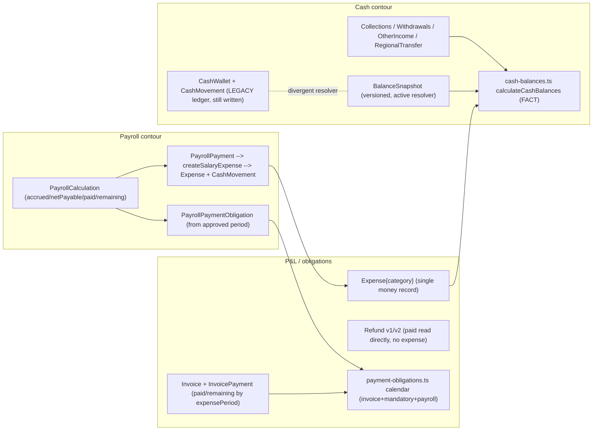
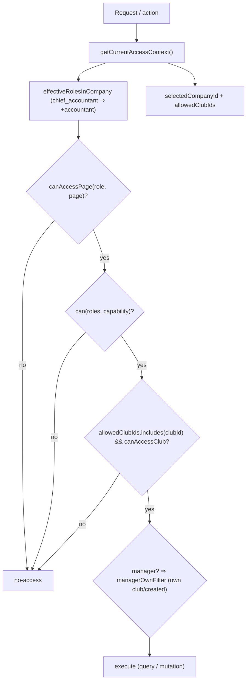
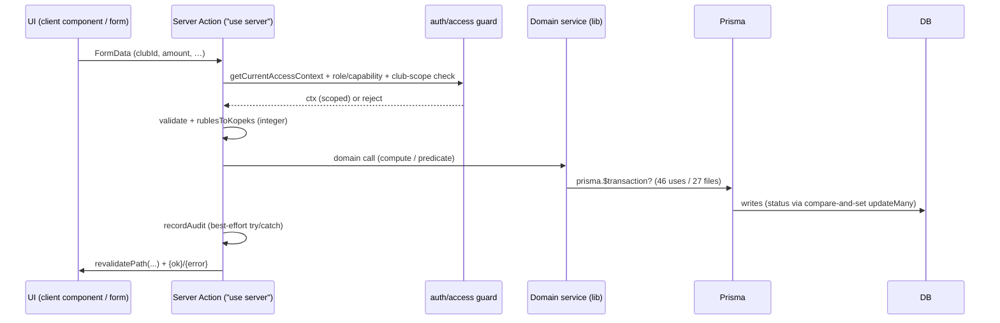
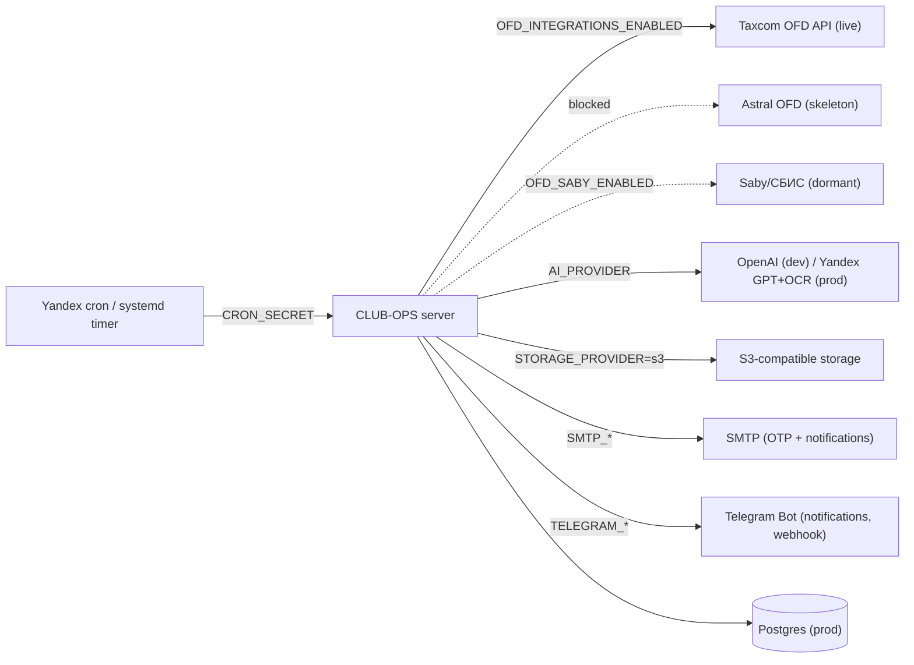

# CLUB-OPS — System Architecture Map

Factual map of the application at commit `71f1cff`. Built from a read-only survey. Stack:
**Next.js 15 App Router + React 18/19 + Prisma** (dev sqlite / prod postgres), multi-tenant
(Company → Club → LegalEntity) financial management for fitness clubs. Money is integer kopeks
everywhere; conversion only via `src/lib/money.ts`. No Prisma enums — statuses are string
constants in `src/lib/**`.

## Layer overview
- **App routes** — `src/app/(app)/**/page.tsx` (Server Components, all `dynamic = "force-dynamic"`).
- **Server actions** — ~263 async fns in 59 `"use server"` files (the mutation surface).
- **API routes** — 17 `route.ts` (downloads, templates, cron, telegram webhook, notification drain, health, me/access).
- **Domain services** — `src/lib/*.ts` (+ `payroll/`, `ofd/`, `ai/`, `notifications/`, `telegram/`, `storage/`, `imports/` subdirs).
- **Authorization** — `src/lib/auth.ts` (roles, capabilities, page access) + `src/lib/access.ts` (tenant/club scoping, effective roles, audit).
- **Data** — single `PrismaClient` singleton (`src/lib/prisma.ts`); **no repository layer, no tenant middleware** — every scope guard is manual per call.

## Module map
| Module | Purpose | Entry points | Main entities | Truth source | External | Roles |
|---|---|---|---|---|---|---|
| **auth/access** | roles, capabilities, tenant scope, audit | `auth.ts`, `access.ts`, `session.ts` | User, Session, CompanyUserAccess, ClubUserAccess, AuditLog | `auth.ts` (role/cap maps) | — | all |
| **invoices** | invoice lifecycle + partial payments | `invoices/actions.ts`, `invoices.ts`, `invoice-payments.ts` | Invoice, InvoicePayment | `invoice-payments.ts` (paid/remaining/derived) | AI, storage | manager/regional/accountant/chief; owner/GD view |
| **expenses** | full + simplified + cash expense | `expenses/*actions.ts`, `expenses.ts`, `expense-simplified.ts` | Expense, ExpenseDocument, ExpenseCategory | `expenses.ts` + `budgets.ts` | AI, storage | manager/regional/accountant; owner/GD approve overrun |
| **refunds** | membership/PT refund calc + approval (v1+v2) | `refunds/*actions.ts`, `refund-workflow.ts` | Refund, RefundDocument | `refund-membership.ts` / `refund-personal-training.ts` | AI, storage | manager/regional |
| **cash/collections** | collections, withdrawals, transfers, reconciliation, snapshots | `collections/actions.ts`, `cash-balances.ts`, `balance-snapshots.ts` | CashCollection/Withdrawal/OtherIncome, CashRegionalTransfer, BalanceSnapshot, CashWallet, CashMovement | `cash-balances.ts` (`calculateCashBalances`) | — | manager/regional/accountant |
| **budgets** | monthly limits + fact/overrun + salary proposals | `budgets/actions.ts`, `proposal-actions.ts`, `budgets.ts` | Budget, BudgetApprovalRequest, BudgetChangeProposal | `budgets.ts` (`computeUsedKopeks`) | — | owner/GD manage; regional approve scoped |
| **payroll** | ФОТ schemes/periods/calc/advances/obligations | `payroll/**/actions.ts`, `lib/payroll/*` | Payroll* (12 models), EmployeeFinancialObligation | `payroll/calc.ts`+`formulas.ts`+`compute.ts` | AI, OFD | owner/GD/regional view+approve; accountant/chief operate |
| **payments/obligations** | payment calendar aggregation | `payments.ts`, `payment-obligations.ts` | (derives Invoice + MandatoryPaymentPlan + PayrollPaymentObligation) | `payment-obligations.ts` | — | owner/GD/regional/accountant |
| **mandatory-payments** | recurring plans | `mandatory-payments/actions.ts` | MandatoryPaymentPlan | `mandatory-payments.ts` | — | owner/GD |
| **sales** | sales records + reports + plans | `sales/*actions.ts`, `sales.ts` | Sale, SalesReport(+Line), SalesPlan | `sales.ts` / `sales-reports.ts` | storage | manager/regional; GD plans |
| **OFD** | fiscal sales import (Taxcom/Astral/Saby) | `settings/**/ofd`, `cron/ofd/daily`, `lib/ofd/*` | Ofd* (14 models) | `ofd/importer.ts` + `ofd/revenue.ts` | Taxcom/Astral/Saby | owner/GD/accountant |
| **analytics/dashboard** | profit, ranking, forecasts | `analytics.ts`, `dashboard.ts`, `forecast.ts` | (aggregates all financial models) | `dashboard.ts`/`analytics.ts` | — | owner/GD/regional/marketer(ltd) |
| **month workflow** | close / controlled reopen | `month-close-actions.ts`, `month-reopen-actions.ts` | MonthClose, MonthReopenRequest | `month-close.ts` | — | chief close; owner approve reopen |
| **notifications** | outbox → Telegram | `notifications/*`, `telegram/*`, drain+webhook routes | NotificationOutbox, TelegramConnection | `notifications/outbox.ts` | Telegram | recipients by role |
| **storage/documents** | upload/download abstraction | `storage/index.ts`, `*-storage.ts`, file routes | document models + disk/S3 | `storage/index.ts` | S3 or local disk | access-gated |
| **AI** | doc extraction (invoice/expense/refund/payroll) | `ai/provider.ts` + analyzers | — | `ai/provider.ts` (dispatch) | OpenAI / Yandex | operational roles |
| **users/onboarding** | invites, roles, multi-account | `users/*actions.ts`, `accept-invite`, `account-actions.ts` | User, Invite, AccountSessionContainer | `access.ts` | email | owner/GD/regional (scoped) |
| **settings** | company/club/legal-entity/OFD/PIN | `settings/*actions.ts`, `legal-entities.ts` | Company, Club, LegalEntity, ClubLegalEntity, OfdConnection | `settings/actions.ts` | OFD | owner/GD |

## External integrations
| Integration | Location | Config |
|---|---|---|
| OFD Taxcom (live) | `ofd/taxcom/*`, `providers/taxcom-provider.ts` | `OFD_SECRET`, `OFD_INTEGRATIONS_ENABLED` |
| OFD Astral (BLOCKED skeleton) | `ofd/astral/*` | encrypted creds (`ofd/crypto.ts`) |
| OFD Saby/СБИС (dormant flag) | `ofd/saby/*` | `OFD_SABY_ENABLED` |
| AI OpenAI + Yandex GPT/OCR | `ai/provider.ts` + clients | `AI_PROVIDER`, `OPENAI_*`, `YANDEX_*` (OpenAI blocked in prod) |
| Storage local/S3 | `storage/index.ts` | `STORAGE_PROVIDER`, `S3_*` |
| Email SMTP | `email.ts` (nodemailer) | `SMTP_*` |
| Telegram | `telegram/*`, webhook+drain routes | `TELEGRAM_*`, `NOTIFICATION_DRAIN_SECRET` |
| Bank | **none** — payments/obligations are internal ledger only |

---

## Diagram 1 — Overall architecture

## Diagram 2 — Financial contours (where money truth lives)

## Diagram 3 — Authorization flow

## Diagram 4 — Data flow (UI → DB) for a mutation

## Diagram 5 — External integrations

## Key invariants (asserted across the codebase)
- Money is integer kopeks; conversion only via `money.ts`.
- Strategic (owner/GD) roles are **read-only** on operational records (enforced by capabilities, not just page access).
- Cash truth = `calculateCashBalances` + versioned `BalanceSnapshot`; regional transfers reduce ИП only when **confirmed**.
- Invoice payment truth = `invoice-payments.ts` ledger; analytics keyed by `expensePeriod` (no double count).
- Payroll → cash-once via `salary-expense.ts::createSalaryExpense` (one Expense + one CashMovement per payout).
- Notifications are outbox-based, delivered async over Telegram.

> Divergences and risks in this map are catalogued in `docs/audits/full-audit-01-code-architecture.md`
> (notably ARCH-001 snapshot-resolver split, ARCH-002 payroll payment transaction gap, ARCH-006
> legacy cash-wallet ledger vs fact-balance contour).
