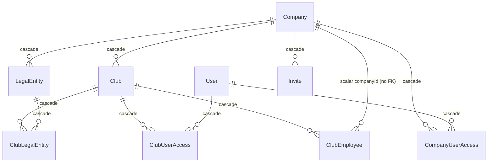
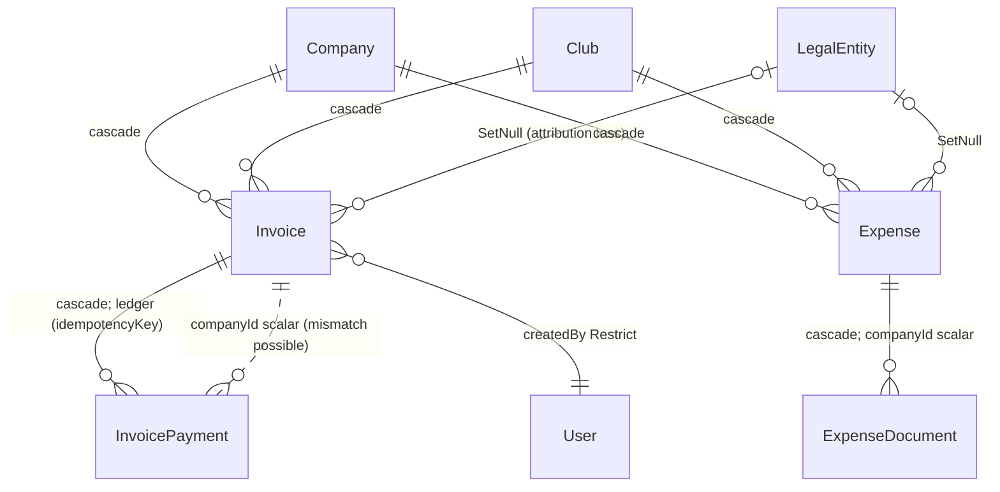
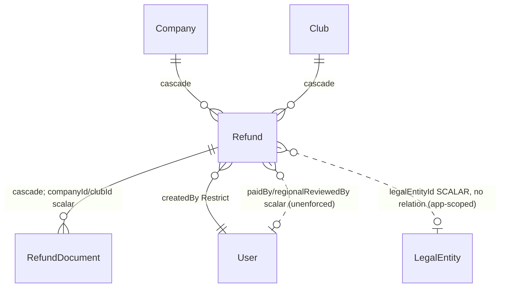
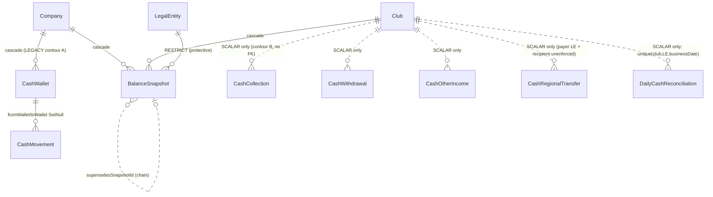
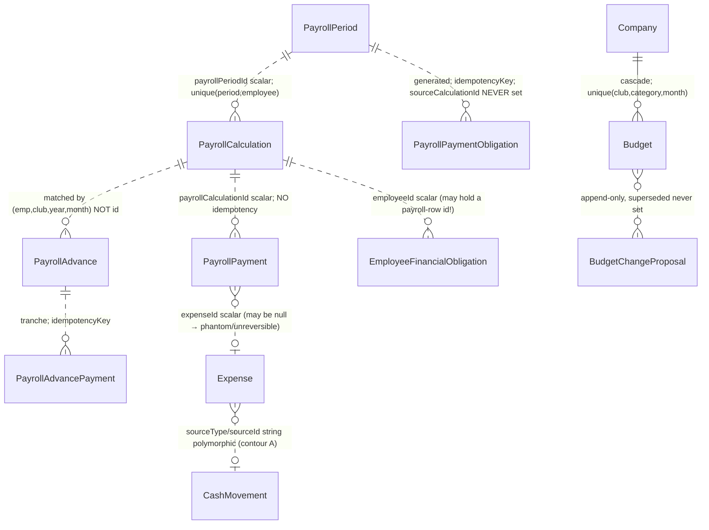
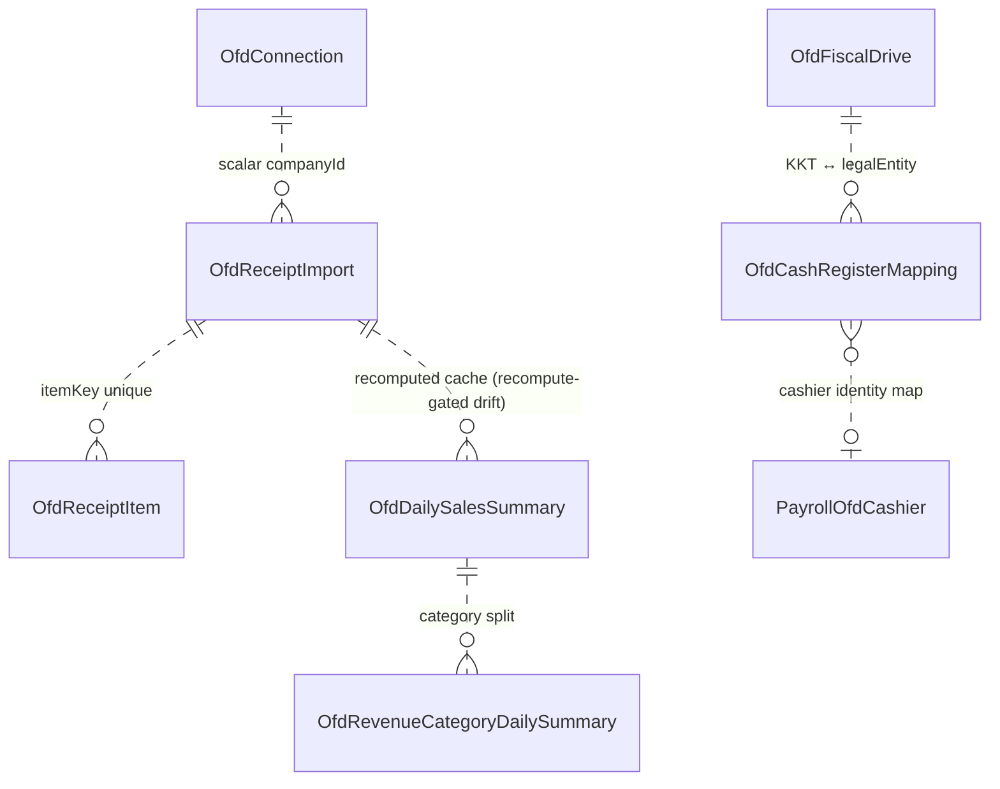
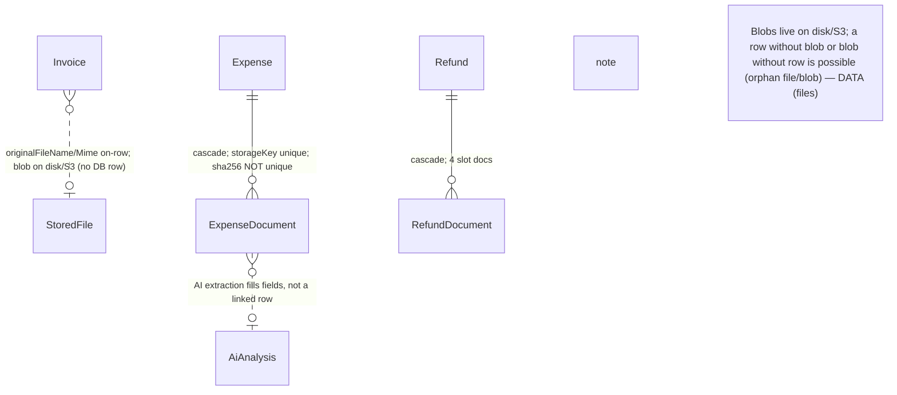

# CLUB-OPS — Entity Relationships

Factual ER map at commit `66bc9e3`. Relation/onDelete data: `docs/audits/data/relation-risks.json`.
**Key structural fact:** the DB provider is SQLite (dev) / Postgres (prod) with **no composite
foreign keys** — a `@relation` FK only proves the referenced row *exists*, never that it shares the
same tenant. So on every denormalized tenant scalar (`companyId`/`clubId`/`legalEntityId`), a
cross-tenant mismatch is **DB-possible**; consistency is application-enforced (DATA-007).

## Relation enforcement summary
| Group | FK style | onDelete | Tenant consistency |
|---|---|---|---|
| Invoice, InvoicePayment, Expense, Refund, Budget, BalanceSnapshot, CashWallet, CashMovement, Sale, MandatoryPayment, documents | **relational** (`@relation`) | mostly **Cascade** to Company/Club; **SetNull** to LegalEntity; **Restrict** to createdBy User | composite not enforced → mismatch possible |
| **All payroll models, CashCollection/Withdrawal/OtherIncome/RegionalTransfer, all OFD, AuditLog** | **scalar-only, NO relations** | **none** | entirely app-enforced; delete leaves orphans |

## Delete/cascade risk (from relation-risks.json — 56 Cascade, 11 SetNull)
- **Company → Club/LegalEntity/Invoice/Expense/Refund/Budget/BalanceSnapshot/CashWallet/CashMovement/Sale/… = Cascade**, and **Company has no soft-delete** → a hard delete wipes relational financial history **and** orphans the scalar-id payroll/cash/OFD/audit rows (partial, inconsistent destruction). **DATA-008 (P0/P1).**
- **LegalEntity → BalanceSnapshot = Restrict** (protective). **LegalEntity ← Invoice/Expense/Sale/MandatoryPayment = SetNull** → historical rows silently lose ИП/ООО attribution. **DATA-009.**
- **createdBy = Restrict** everywhere + User soft-tombstone → relational creators never orphan. But reviewer/approver/paidBy ids on scalar-only models are unenforced. **DATA-025.**

---

## Diagram 1 — Company / Club / LegalEntity / User

## Diagram 2 — Invoices / InvoicePayments / Expenses

## Diagram 3 — Refunds

## Diagram 4 — Cash / Collections / Snapshots (two contours)

## Diagram 5 — Payroll / Budget / Obligations / Payments (all scalar links)

## Diagram 6 — OFD / Revenue / Analytics

## Diagram 7 — Files / Documents / AI

## Cardinality / ownership / delete table (audit-relevant)
| Relation | Card | Nullable | Enforced | onDelete | Mismatch/orphan risk | Finding |
|---|---|---|---|---|---|---|
| Invoice→club | N:1 | no | DB | Cascade | club.companyId may ≠ invoice.companyId | DATA-007 |
| Invoice→legalEntity | N:1 | yes | DB+app | SetNull | LE of another company; attribution loss on delete | DATA-007/009 |
| InvoicePayment→invoice | N:1 | no | DB | Cascade | `companyId` scalar may mismatch invoice | DATA-007 |
| Refund→legalEntity | scalar | yes | **app-only** | — | LE cross-company; unenforced | DATA-007 |
| PayrollPayment→calc/employee/LE | scalar | mixed | **none** | — | any mismatch; orphan on delete | DATA-007/025 |
| EmployeeFinancialObligation→employee | scalar | yes | **none** | — | **can hold a RegionalCityPayroll.id** | DATA-010 |
| BalanceSnapshot→legalEntity | N:1 | no | DB | **Restrict** | protective | — |
| Company→(all relational children) | 1:N | no | DB | **Cascade** | wipes financial history; no soft-delete | DATA-008 |
| LegalEntity→BalanceSnapshot | 1:N | no | DB | Restrict | protective | — |
| LegalEntity←Invoice/Expense/Sale | 1:N | yes | DB | **SetNull** | orphan attribution | DATA-009 |
